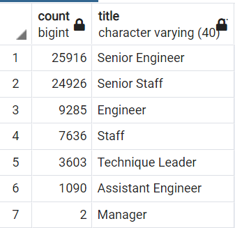

# Pewlett-Hackard-Analysis.

## Overview of the analysis
I need to gauge the possibility of smooth responsibility shift from retiring staff to new/promoted employees. The smoothness depends on the ability of the departments to mentor the next generation of employees.

## Results
- There are 50 times less potential mentors (1,549) than retiring employees (more than 70,000)
- Most retiring employees belong to senior staff. It takes  time to prepare senior specialists.

- There are not only enough mentors; proportions of different titles among retirees and mentors differ dramatically. Shortage of experienced engineers is obvious.

- There is only one position lower than Senior Staff (Staff), but two positions lower than Senior Engineer (Assistant Engineer and Engineer). So it takes longer to prepare/promote an Assistant Engineer to a Senior Engineer than Staff to Senior Staff.

## Summary
- There are more than 70,000 positions to be replaced.
- If we look at proposed approach to mentorship, there will definitely be not enough mentors to train new/promoted employees to replace retirees.
- As I see it, the only option is to expand mentor base. If we take 1962-1965-born mentors, we'll have more than 56,000 of them, which is, depending on position, about 0.5-0.8 mentors per a recently promoted person/new comer. That is more than enough even if mentors train junior employees part-time and still deliver on their main responsibilities. And mentor title proportions are much closer to retiree title proportions now, especially in terms of senior staff:

Retirees|Mentors
---|---
|